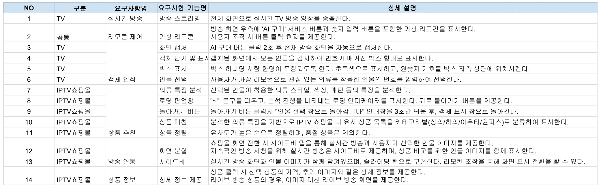

# 🛒 IPTV 홈쇼핑 - 실시간 AI 상품 추천 서비스 👍
 

## 🎯 3차 프로젝트 개요
- **프로젝트명**: 실시간 AI 상품 추천 서비스
- **목표**: 시청 중인 TV 프로그램에서 **원하는 상품**을 즉시 구매할 수 있도록 IPTV 홈쇼핑 채널과 연계한 **고객 맞춤형 채널 추천 서비스** 구현
- **기간**: 2024년 11월 - 2024년 12월
  

## 😎 팀원 소개
<table style="width:100%; text-align:center; table-layout:fixed;">
  <colgroup>
    <!-- 전체 5열이므로 20%씩 -->
    <col style="width:20%;">
    <col style="width:20%;">
    <col style="width:20%;">
    <col style="width:20%;">
    <col style="width:20%;">
  </colgroup>
  <thead>
    <tr>
      <th>박시원</th>
      <th>이상민</th>
      <th>이지선</th>
      <th>임세연</th>
      <th>전서영</th>
    </tr>
  </thead>
  <tbody>
    <tr>
      <td></td>
      <td>img</td>
      <td>img</td>
      <td></td>
      <td></td>
    </tr>
    <tr>
      <td>PM 데이터 파이프라인</td>
      <td>DB구축 클라우드 관리</td>
      <td>AI 프론트엔드</td>
      <td>AI 백엔드</td>
      <td>AI 데이터 파이프라인</td>
    </tr>
    <tr>
      <td>
</td>
      <td></td>
      <td></td>
      <td></td>
      <td></td>
    </tr>
  </tbody>
</table>
 

## 🛠 기술 스택
### Languages & Frameworks
- Programming Languages :    
- Web Frameworks :  

### Data Collection & Processing
- Libraries :  

### Database & Infrastructure
- Database : 
- Cloud :    

### AI / Machine Learning
- Object Detection :  
- Deep Learning Framework : 
 

---------------------------------------
## 📃 문서

  
요구사항 정의서

  ### 1. 프로젝트 전반 요구사항
  <!-- summary 다음에 한 줄 띄우고 테이블 삽입 -->
  <table border="1" style="border-collapse:collapse; width:100%; text-align:center;">
    <thead>
      <tr>
        <th colspan="3" style="background-color:#B0C4DE; height:40px;">
          프로젝트 전반 요구사항
        </th>
      </tr>
      <tr style="background-color:#EAEAEA;">
        <th style="width:15%;">구분</th>
        <th style="width:15%;">항목</th>
        <th style="width:70%;">내용</th>
      </tr>
    </thead>
    <tbody>
      <tr>
        <td rowspan="3">서비스 개요</td>
        <td>프로젝트명</td>
        <td>실시간 AI 홈쇼핑 상품 추천 서비스</td>
      </tr>
      <tr>
        <td>서비스 대상</td>
        <td>중장년층 여성 시청자 중심</td>
      </tr>
      <tr>
        <td>서비스 범위</td>
        <td>여성 패션/뷰티 관련 방송 프로그램 및 IPTV 쇼핑몰 연동</td>
      </tr>
      <tr>
        <td>사용자 환경</td>
        <td>대상 플랫폼</td>
        <td>WEB 기반 TV 방송 및 IPTV 쇼핑몰</td>
      </tr>
      <tr>
        <td rowspan="2">기술 요구사항</td>
        <td>AI 기술</td>
        <td>
          실시간 객체 인식 
          의류 특정 분석 
          유사 상품 매칭</td>
      </tr>
      <tr>
        <td>성능</td>
        <td>
          방송 지연 최소화 
          상품 추천 AI 분석 응답 2초 이하 
          직관적인 UI와 끊김 없는 화면 전환
        </td>
      </tr>
      <tr>
        <td rowspan="2">서비스 품질</td>
        <td>안정성</td>
        <td>
          24시간 실시간 방송 스트리밍 
          동시 접속자 처리 
          오류 복구 시스템</td>
      </tr>
      <tr>
        <td>확장성</td>
        <td>
          연령대별 카테고리 세분화 및 남성 패션 확장 
          여성 패션 카테고리 세분화 및 남성 패션 확장 
          찜하기/장바구니와 같은 신규 기능 추가
        </td>
      </tr>
      <tr>
        <td>제약 사항</td>
        <td>데이터 처리</td>
        <td>
          개인정보 보호 
          방송 저작권 준수 
          데이터 보안
        </td>
      </tr>
    </tbody>
  </table>

  ### 2. 프로젝트 상세 요구사항
  

  
UML

  ### 유스케이스 다이어그램
  

  ### 시퀀스 다이어그램
  

  ### 클래스 다이어그램
  
  

WBS

  
화면 설계서

  
   
  
  *추후 업데이트 예정*

- [모델 정의서 (PDF)](./docs/model_definition.pdf)

- [모델 성능 평가서 (PDF)](./docs/model_evaluation.pdf)

  
API 명세서

   
  
  *추후 업데이트 예정*

  
ERD

  

  
시스템 아키텍처

  

 

-----------------------------------------

# 📑 최종 보고서
- [최종 보고서 (발표 PPT.PDF)](./docs/final_report.pdf)
 

-----------------------------------------

# ✨ 회고

<table border="1" style="border-collapse:collapse; width:100%; text-align:center;">
  <thead>
    <tr>
      <th style="background-color:#f2f2f2;">팀원</th>
      <th style="background-color:#f2f2f2;">회고록</th>
    </tr>
  </thead>
  <tbody>
    <tr>
      <td>박시원  </td>
      <td>업데이트 예정</td>
    </tr>
    <tr>
      <td>이상민  </td>
      <td>업데이트 예정</td>
    </tr>
    <tr>
      <td>이지선  </td>
      <td>업데이트 예정</td>
    </tr>
    <tr>
      <td>임세연  </td>
      <td>업데이트 예정</td>
    </tr>
    <tr>
      <td>전서영  </td>
      <td>업데이트 예정</td>
    </tr>
  </tbody>
</table>
 

## 📌 Git Convention
- **<타입>(<범위>): <설명>**

### 타입(Type)

| 타입       | 설명                                                                 |
|------------|----------------------------------------------------------------------|
| `feat`     | 새로운 기능 추가                                                    |
| `fix`      | 버그 수정                                                           |
| `docs`     | 문서 변경 (예: README 수정)                                         |
| `style`    | 코드 스타일 변경 (포맷팅, 세미콜론 누락 등, 기능 변경 없음)         |
| `refactor` | 코드 리팩토링 (기능 추가나 버그 수정이 아닌 코드 구조 개선)         |
| `perf`     | 성능 개선                                                           |
| `test`     | 테스트 코드 추가 또는 수정                                          |
| `chore`    | 빌드 프로세스 또는 보조 도구 변경 (예: 패키지 매니저 설정 등)       |
